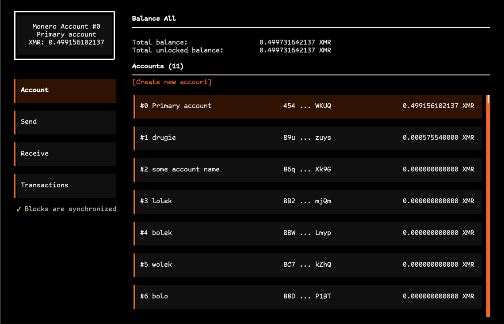

# Monero TUI

> [!IMPORTANT]
> Monero TUI is still not stable and its not recommended to use it for important transactions.\
> Consider it as being in alpha phase. Currently only Linux is supported on release builds.\
> However debug builds of macOS should work fine (except the fact that they're not signed).

Monero TUI is a terminal user interface based application to manage your Monero wallet.\
It tries to be familiar in style to the Monero GUI app.

It is written in Deno and uses FFI bindings to [monero_c](https://github.com/MrCyjaneK/monero_c/tree/master) to communcate with Monero API's.

  

## 💗 Support
If you consider this project helpful and would like to support its development consider donating:
- **Monero**: `89BoVWjqdGVe68wdxbYurXR8sXaEb96eWKYRPxdT6wSCfZYK6XSHoj5ZRXQLtd7GzL2B2PD7Lb7GSKupkXMWjQVFAEb1CK8`
- [**Github Sponsors**](https://github.com/sponsors/Im-Beast)
- [**Revolut**](https://revolut.me/imbeast)

## 🤝 Contributing

**Monero TUI** is open for any contributions.
  If you feel like you can enhance this project - please open an issue and/or pull request.
  Code should be well document and easy to follow what's going on.

This project follows [conventional commits](https://www.conventionalcommits.org/en/v1.0.0/) spec.
  If your pull request's code can be hard to understand, please add comments to it.

## 📝 Licensing

This project is available under **GPLv3.0** License conditions.
